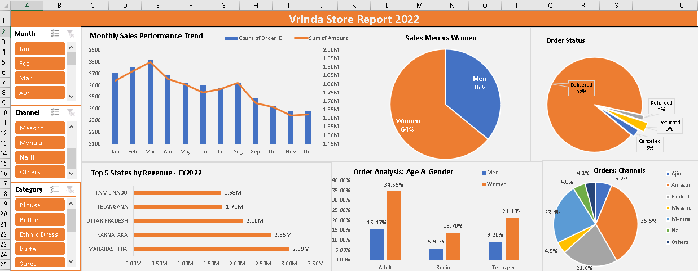

# 📊 Vrinda Store Annual Sales Analysis Dashboard – 2022

[](#)
[](#)
[](#)

> An interactive **Excel dashboard** visualizing Vrinda Store’s 2022 sales performance, customer demographics, and channel efficiency.  
> This project transforms raw retail data into **actionable insights** using Excel’s advanced analytics and visualization tools.

---

## 🧭 Overview

**Business Problem:**  
Vrinda Store needed a clear understanding of **yearly sales patterns, customer profiles, and regional performance** to make data-driven marketing and inventory decisions.

**Delivered Solution:**  
A **fully interactive Excel dashboard** featuring dynamic slicers, pivot charts, KPIs, and professional design that allows stakeholders to explore sales, customer segments, and order performance with a single click.

---

## 🖼️ Dashboard Preview

Here’s a visual preview of the final dashboard 👇




---

## 🎯 Key Business Questions

1. What were the overall sales and order trends in 2022?  
2. Who are the main customers by gender and age group?  
3. Which states or regions contributed most to revenue?  
4. Which platforms (Amazon, Flipkart, Myntra, etc.) performed best?  
5. What product categories generated the highest revenue?  
6. When did sales peak during the year?  
7. What is the delivery, return, and cancellation rate?

---

## 🛠️ Tools & Techniques

| Category | Tools / Techniques |
|-----------|--------------------|
| **Software** | Microsoft Excel 2016 / 365 |
| **Data Cleaning** | Power Query, Text Functions, Data Validation |
| **Analysis** | Pivot Tables, Advanced Excel Formulas (`SUMIFS`, `COUNTIFS`, `INDEX-MATCH`) |
| **Visualization** | Column, Line, Pie, and Bar Charts |
| **Interactivity** | Slicers, Filters, Conditional Formatting |
| **Design** | Professional layout, Color consistency, KPI cards |

---

## 📈 Dashboard Highlights

### 🔍 Interactive Filters
- Filter by **Month**, **Channel**, **Category**, or **Region**  
- All visuals dynamically update with slicer selection  

### 💡 Key Performance Indicators (KPIs)
- **Total Revenue:** ₹34.5M  
- **Total Orders:** 21,320  
- **Average Order Value:** ₹1,620  
- **Fulfillment Rate:** 92% Delivered  
- **Peak Sales Month:** March  
- **Top Performing Channel:** Amazon  

### 📊 Visual Insights
- **Monthly Sales Trend:** Orders vs. Revenue (dual-axis)  
- **Customer Gender Split:** 64% Women, 36% Men  
- **Order Status Breakdown:** 92% Delivered, 3% Cancelled, 3% Returned, 2% Refunded  
- **Top 5 States by Revenue:** Maharashtra, Karnataka, Uttar Pradesh, Telangana, Tamil Nadu  
- **Age & Gender Analysis:** Adults (25–45) dominate with 34.6% of total sales  
- **Channel Share:** Amazon (35%), Flipkart (22%), Myntra (21%), Others (22%)  

---

## 🔎 Insights Summary

1. **Sales Trends:**  
   - Strong Q1–Q2 performance with a **sales peak in March**  
   - Gradual decline in Q4 due to seasonal slowdown  

2. **Customer Profile:**  
   - **Women (64%)** are the primary customers  
   - **Adults (25–45 years)** contribute most revenue  

3. **Regional Performance:**  
   - **Maharashtra** leads, followed by **Karnataka** and **Uttar Pradesh**  

4. **Channel Analysis:**  
   - **Amazon (35%)** is the top channel, followed by Flipkart and Myntra  
   - Multi-channel strategy proved highly effective  

5. **Order Fulfillment:**  
   - **92% successful delivery rate** — strong logistics  
   - Low return and refund ratio indicates product satisfaction  

---

## 💼 Business Recommendations

✅ **Target Women Aged 25–45**  
- Create personalized marketing campaigns  
- Expand categories popular among this demographic  

✅ **Prioritize Top States**  
- Increase stock and promotions in Maharashtra & Karnataka  

✅ **Optimize Amazon Strategy**  
- Improve SEO, visuals, and use Amazon Ads to boost visibility  

✅ **Plan Seasonal Promotions**  
- Capitalize on high-sales months (e.g., March–April)  

✅ **Reduce Returns (3%)**  
- Enhance product descriptions, imagery, and size details  

---

## ⚙️ Technical Implementation

### Data Preparation
- Removed duplicates and invalid entries  
- Standardized category and region labels  
- Added calculated fields (Age Group, Month, Quarter)  
- Validated dataset consistency  

### Dashboard Design
- Clean, corporate color palette (Orange + Blue)  
- KPIs placed at the top for quick scanning  
- Responsive slicers controlling all charts  
- Optimized layout for readability and export  

### Sample Formulas
```excel
Total Sales = SUM(Amount)
Order Fulfillment Rate = Orders_Delivered / Total_Orders
Average Order Value = Total_Sales / Total_Orders
Age Group = IF(Age<20,"Teen",IF(Age<40,"Adult",IF(Age<60,"Middle Age","Senior")))
